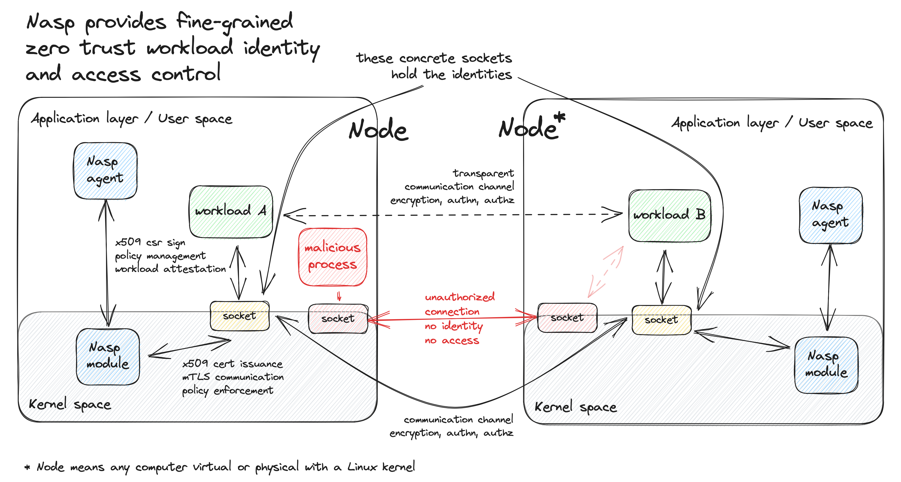

# Nasp

## Introduction

The [Nasp](https://github.com/cisco-open/nasp) system a set of projects, which in tandem are capable of enhancing plain old TCP sockets in a frictionless way, so that application developers can focus on their business logic instead of dealing with the complexity of TLS, mTLS, and other security-related concerns. It is doing this seamlessly, no code changes or re-compilations or re-deployments are required. You only have to configure Nasp itself, and it will do the rest.

The features are the following:
- providing zero-trust identity for UNIX TCP sockets through mTLS
- access control, authorization and authentication (through [OPA](https://www.openpolicyagent.org))
- providing frictionless TLS termination for those TCP sockets
- supporting every Linux based machine (bare-metal, vanilla VM, Kubernetes, etc... you name it)

This repository contains the source code of the `nasp` multi-purpose binary for controlling the [nasp-kernel-module](https://github.com/cisco-open/nasp-kernel-module), which is a kernel module that does the processing of the user traffic.

## Architecture

Nasp's architecture consists of currently 2 different components: the kernel module and the agent. This will change in the future, we plan to add a control-plane, but the current architecture is the following:



## Components

The Nasp kernel module comes with a user space [CLI](./cli/) written in Go. The kernel module exposes a character device: `/dev/nasp`, which is opened by the agent, the CLI talks with the agent. One usually runs this CLI on the Linux host itself.

### Agent (server)

The agent is the server side of the CLI. It is responsible for the following:
- communicates with the kernel module directly
- parses and compiles the policy file to Wasm and loads to the kernel module
- signs CSR requests generated by the kernel module
- adds metadata from the host environment to enrich process data. (e.g. Kubernetes, AWS, etc...)

Usage:

```bash
sudo nasp agent
```

### Client

```bash
nasp load-policy --policy-file ./policy.json
```

## Development

### Development environment

Our primary development environment is [Lima](https://lima-vm.io) since it supports x86_64 and ARM as well. Follow the instructions for [nasp-kernel-module](https://github.com/cisco-open/nasp-kernel-module#coding) for setting up the development environment.

### Build

The CLI is written in Go, so you need to have a Go development environment set up. The CLI is built with the help of [Makefile](./Makefile), so you need to have `make` installed as well.

```bash
GOOS=linux make build
```

### Run the agent on the Lima guest

```bash
sudo ./bin/nasp --rules-path $(pwd)/rules.d
```

## Community

Join our community on [Slack](https://join.slack.com/t/outshift/shared_invite/zt-26xfl4muq-zcDSfsA_7eOWlyhjvBGqVQ), and then
find us in the [Nasp](https://outshift.slack.com/channels/nasp) channel for more fun!
